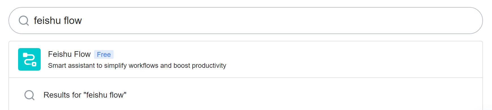
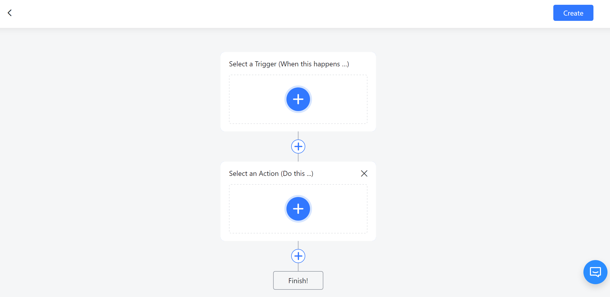
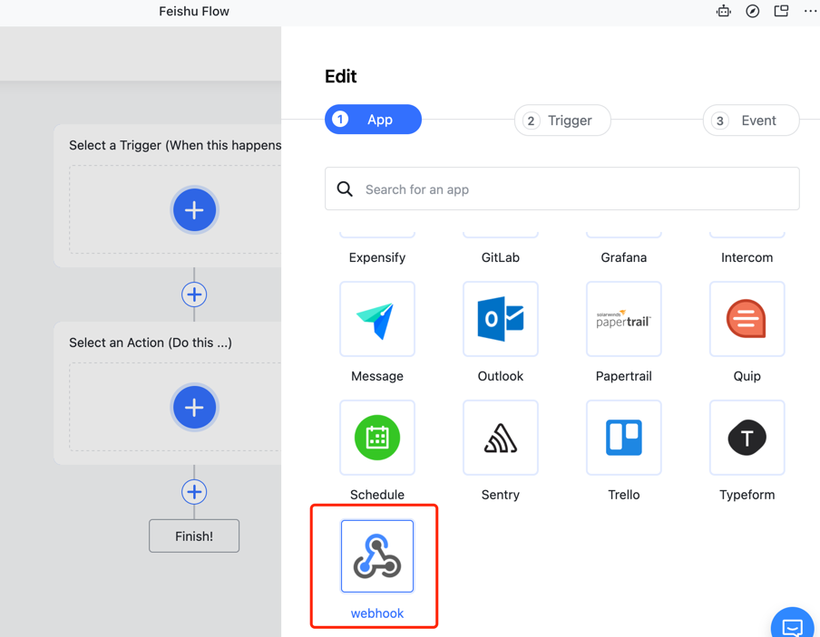
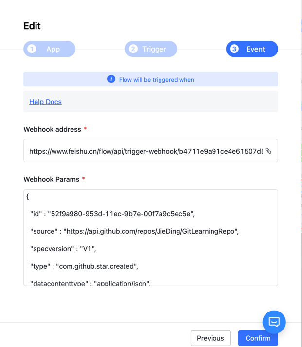
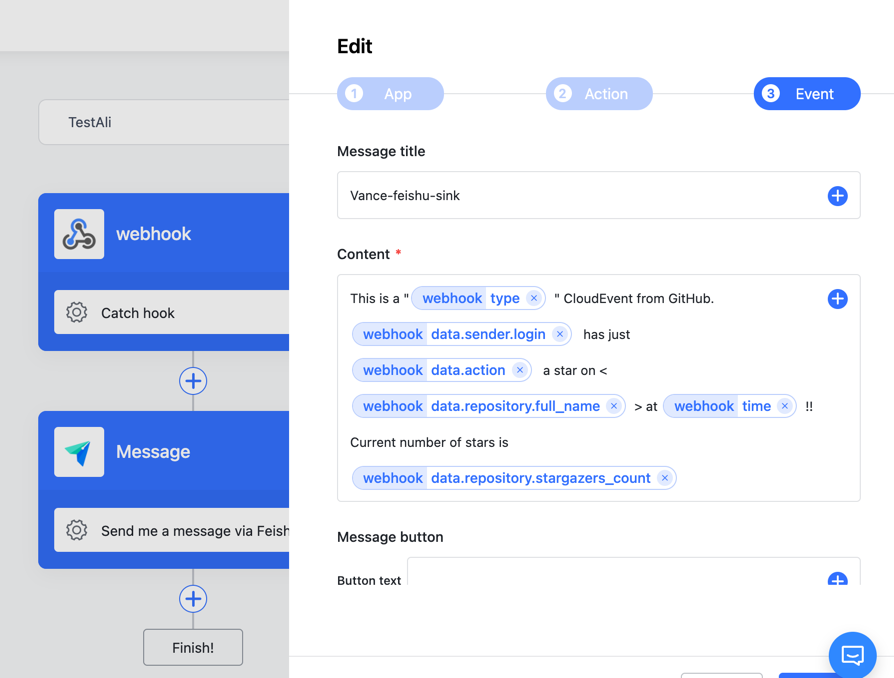

# Feishu flow instruction

## I. Intro

Feishu Flow is designed as an automation tool. By combining different products and services to form an automatic workflow, Feishu Flow allows you to check external information without leaving Feishu. For example, you can build a flow which allows you to get notified in Feishu when you receive a complaint in your external email system.
In order to build this automated workflow, you need to set the following components:

- Trigger - Specifies the trigger event of your flow. For example, external mailbox receives an email.

- Action - Specifies the actions to be executed once the flow is triggered. For example, send messages to me on Feishu.

- Path - [optional] You can set multiple parallel actions by adding Paths. For example, if the email contains attachments, notify me via Feishu message and create a record in Sheet 1. Otherwise, create a record in Sheet 2.
When Trigger and Actions are linked, an automated workflow is created. 

## II. Steps
### Create Feishu Flow

Type Feishu Flow in the search bar and select the app. 

In the **Home** tab, click **+ Create** to create a new flow. Specify the Trigger and Action of the flow.

For my example, I created a flow that receives CloudEvents from outside and send these events to our feishu bot chat.

#### config your webhook

You can get the webhook address and copy it to the `config.json`

Then copy sample data to Webhook Params.

**Select** an **Action**, click **Message** in App, 
select **Send me a message via Feishu Flow bot**, 
type something you want In **Message title**, 
write a pattern to render the **Content**.

Here is my example:

Now, you've set up your feishu flow to receive events and deliver them to your feishu bot.
